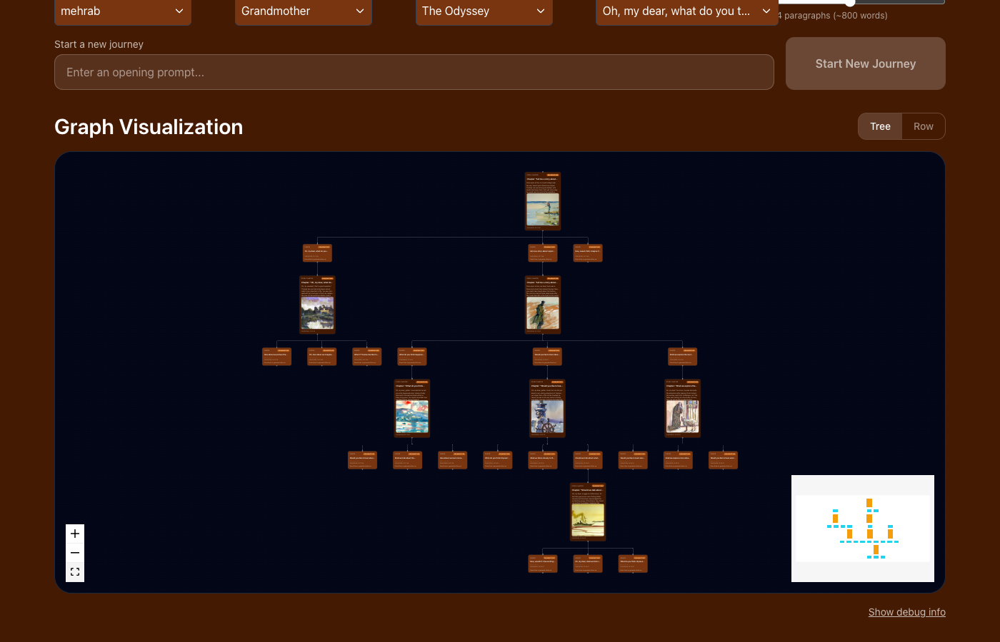

# Storyteller

An AI-powered interactive storytelling app that generates branching narratives from classic literature. Users guide the story through choices, building a graph of interconnected chapters — each with AI-generated text and images. Every generated chapter is history-aware: the system traces the path from root to the current node, so each story chunk reflects the user's cumulative journey and addresses their evolving interests — not just the immediate prompt.



## Key Features

- **Branching narrative graphs** that grow with each user choice
- **RAG-grounded generation** — stories are anchored in source material via hybrid retrieval (ChromaDB + BM25)
- **DALL-E image generation** for every chapter (impressionist watercolour style)
- **6 storyteller personas** with distinct voices and temperature settings (Grandmother, Professor, HAL 9000, Pirate, Freud, Extreme Summariser)
- **6 text corpuses** — Mahabharata, Odyssey, Arabian Nights, Volsunga Saga, Jataka Tales, Locus Platform Docs
- **Real-time streaming** via Server-Sent Events
- **Save and reload journeys** per user
- **Two visualization modes** — tree (ELK hierarchical layout) and row (horizontal scroll)
- **Prompt guardrails** — OpenAI moderation + custom intent classifier

## Tech Stack

| Layer | Stack |
|-------|-------|
| Backend | Python 3.12, FastAPI, LangGraph, LangChain, ChromaDB, NetworkX |
| Frontend | React 18, TypeScript, Vite, ReactFlow, Tailwind CSS, ELK.js |
| AI | OpenAI GPT-4o-mini (text), DALL-E 2 (images), text-embedding-3-small (vectors) |
| Data | ChromaDB (semantic search), BM25 (keyword search), file-based JSON (journeys) |

## Project Structure

```
storyteller/
├── storyteller_backend/        # FastAPI backend (Python)
│   ├── api/                    # main.py, routes/, dependencies.py
│   ├── services/               # story_agent, auth, journey_manager, image_generator
│   ├── models/                 # Pydantic models, LangGraph state
│   ├── config/                 # settings.py, personas.json, jobs.yaml
│   ├── embed_retrieve/         # Hybrid retriever (ChromaDB + BM25)
│   ├── data/                   # corpus_registry.json
│   └── tests/                  # pytest suite
├── storyteller_frontend/       # React/Vite frontend (TypeScript)
│   └── src/
│       ├── components/         # graph/, dropdowns/, debug/
│       ├── hooks/              # useSSE, useELKLayout, useRowLayout, useLocalStorage
│       ├── services/           # api.ts — all backend calls
│       ├── context/            # AppContext — global state
│       ├── types/              # TypeScript type definitions
│       └── utils/              # layout engines, graph transforms
├── data/                       # ChromaDB vector databases, BM25 indexes, processed chunks
├── saved_graphs/               # Persisted user journeys (JSON)
├── raw_texts/                  # Source text files (PDFs and .txt)
├── validation/                 # Behavior test manifests
├── docs/                       # Design specs and implementation plans
├── pyproject.toml              # Poetry dependency management
└── CLAUDE.md                   # AI assistant guide
```

## Quickstart

### Prerequisites

- Python 3.12+
- Node.js 18+
- [Poetry 2.x](https://python-poetry.org/docs/#installation)
- An OpenAI API key ([get one here](https://platform.openai.com/api-keys))

### 1. Install dependencies

```bash
# Backend (from repo root)
poetry install

# Frontend
cd storyteller_frontend && npm install
```

### 2. Configure environment

```bash
# Copy the example and add your OpenAI key
cp storyteller_backend/.env.example storyteller_backend/.env
# Edit storyteller_backend/.env → set OPENAI_API_KEY
```

### 3. Start the servers

```bash
# Backend (port 8000)
cd storyteller_backend && poetry run python -m api.main

# Frontend (port 3000, in a separate terminal)
cd storyteller_frontend && npm run dev
```

### 4. Verify

```bash
curl http://localhost:8000/health
# → {"status":"healthy","api_host":"0.0.0.0","api_port":8000,"auth_mode":"self_hosted"}
```

Open http://localhost:3000 in your browser.

### 5. Use the app

1. Select or create a **username**
2. Pick a **persona** and **corpus**
3. Type an opening prompt and click **Start New Journey**
4. Watch the story stream in, then click a **choice node** to continue
5. Your journey is auto-saved — reload it anytime from the **Load Journey** dropdown

## Validation & AI-Driven Development

This project uses a behavior-driven development workflow where natural-language test manifests drive both testing and feature implementation via Claude Code.

**Two test manifests** define the expected behavior of the entire app:

- **[`validation/app-behaviors.md`](validation/app-behaviors.md)** — 38 end-to-end tests that a Claude Code agent executes via Playwright MCP in a headless browser (clicking, typing, screenshotting — like a real user)
- **[`validation/BE-behaviours.md`](validation/BE-behaviours.md)** — 33 backend API tests exercised via direct HTTP calls

**Two Claude Code skills** automate the loop:

| Skill | Command | Purpose |
|-------|---------|---------|
| **test-app** | `/test-app` | Runs the full behavior suite via Playwright, produces a timestamped pass/fail report with screenshots |
| **fix-tests** | `/fix-tests` | Reads the latest test report, implements fixes for every failure, verifies each fix, then re-runs the full suite |

**The workflow for implementing new features:**

1. Write a new test in the behavior manifest describing the feature as if it already exists (including `status: unimplemented`)
2. Run `/test-app` — the new test fails as expected
3. Run `/fix-tests` — Claude Code reads the failure, implements the feature to make the test pass, then re-runs the suite to catch regressions
4. Repeat until all tests pass

This approach has been used to build features like placeholder nodes during streaming, image generation, row mode visualization, and prompt guardrails — each started as a failing test description that Claude Code then implemented autonomously.

See **[`validation/DOCUMENTATION.md`](validation/DOCUMENTATION.md)** for the full engineering reference.

## Documentation

- **[Backend DOCUMENTATION.md](storyteller_backend/DOCUMENTATION.md)** — API reference, services, data models, retrieval pipeline
- **[Frontend DOCUMENTATION.md](storyteller_frontend/DOCUMENTATION.md)** — Components, hooks, state management, layout engines
- **[Validation DOCUMENTATION.md](validation/DOCUMENTATION.md)** — Behavior-driven test manifests, skills, and AI development workflow
- **[CLAUDE.md](CLAUDE.md)** — AI assistant development guide

## License

MIT License — Copyright (c) 2025 Mehrab Modi
